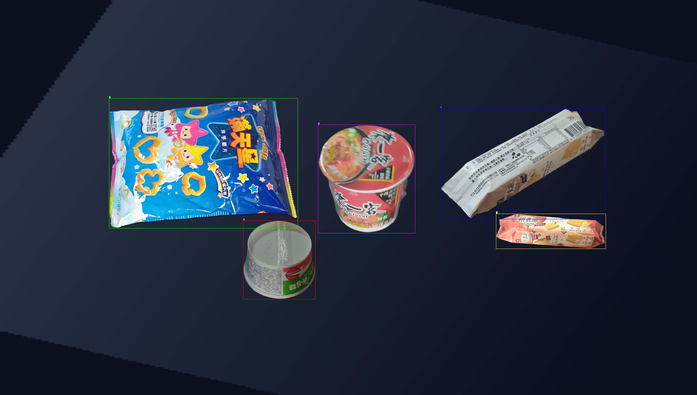
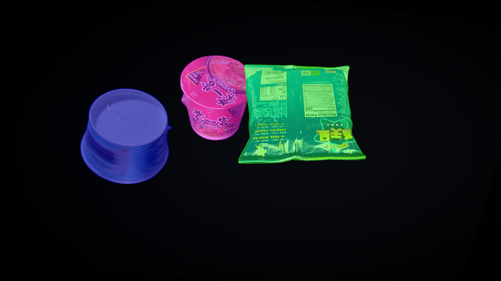

# Synthetic Data Generation Tool

This repository contains tools for generating synthetic images by combining objects with various backgrounds to create diverse datasets for machine learning training.

## Project Overview

This tool is designed to solve a critical challenge in computer vision development: the need for large, diverse datasets of object images in various real-world contexts. Here's what makes this project powerful:

### Key Features

- **Automated Image Generation**: Combines object images with various backgrounds to create realistic, synthetic training data
- **Multi-Processing Support**: Offers both single and multi-process modes for efficient image generation
- **Smart Alpha Channel Handling**: Uses transparency information for precise object placement
- **Flexible Dataset Creation**: Supports multiple object categories (no limits) and various background scenarios
- **Automatic Labeling**: Generates labels suitable for machine learning training pipelines

### Use Cases

- Training object detection models
- Developing computer vision systems
- Creating synthetic datasets
- Testing object placement algorithms
- Generating synthetic data for environment simulation

### Benefits

- Reduces the need for manual photo shoots
- Creates consistent, well-labeled datasets
- Enables rapid testing with different environmental conditions
- Saves time and resources in dataset creation
- Ensures diverse training data for better AI model performance

## Sample Workflow

## For Object Detection

### Input

#### Background Image


#### Product Images


### Output



## For Image Segmentation



## Setup

1. Clone the repository:

```bash
git clone https://github.com/HGSChandeepa/Synthetic-data-generation.git
```

2. Create and activate a virtual environment (optional but recommended):

```bash
python -m venv .venv

# Activate (each new terminal)
# macOS/Linux:
source .venv/bin/activate
# Windows CMD:
.venv\Scripts\activate.bat
# Windows PowerShell:
.venv\Scripts\Activate.ps1

```

1. Install required dependencies:

```bash
pip install -r requirements.txt
```

4. Prepare your data structure:
   - Place background images in the `backgrounds/` folder
   - Place product images in their respective numbered folders under `products/`
   - Ensure your dataset configuration is set in `dataset/data.yaml`

## Directory Structure

```
├── backgrounds/          # Background images
├── products/            # Product images (organized by categories 1-20)
├── dataset/             # Dataset configuration and labels
├── images/              # Sample images
└── visualization/       # Visualization outputs
```

## Image Labeling Mechanism

The system uses alpha channels for precise product placement and masking:

1. **Alpha Channel Usage**:

   - Product images should have transparent backgrounds (alpha channel)
   - The alpha channel is used to:
     - Determine exact product boundaries
     - Create precise masks for placement
     - Maintain product integrity during compositing

2. **Product Placement**:
   - Products are placed on backgrounds using their alpha channels
   - This ensures clean edges and natural-looking integration
   - No manual masking required due to alpha channel automation

## Running the Program

1. Single Process Mode:

```bash
python main.py
```

2. Multi-Process Mode (for faster processing):

```bash
python multiple_processes_main.py
```

3. Validation:

```bash
python validate.py
```

## Output

- Generated images will be saved in the specified output directory
- Each image combines a background with one or more products
- Labels are automatically generated for AI training

## Notes

- Ensure product images have transparent backgrounds
- Background images should be high resolution
- Check `data.yaml` for dataset configuration
